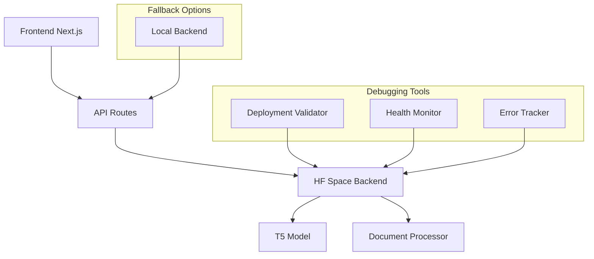

# Design Document: Debug HF Space Deployment

## Overview

This design addresses the systematic debugging and fixing of HF Space deployment issues causing 500 errors in the AquaHumanizer Pro backend. The approach focuses on verification, diagnostics, monitoring, and fallback solutions to ensure reliable document processing.

## Architecture

### System Components



### Debugging Strategy

1. **Verification Phase**: Confirm HF Space has latest code and dependencies
2. **Diagnostics Phase**: Identify specific failure points in the backend
3. **Monitoring Phase**: Implement comprehensive logging and health checks
4. **Optimization Phase**: Fix performance and timeout issues
5. **Fallback Phase**: Provide local backend alternative

## Components and Interfaces

### 1. Deployment Validator

**Purpose**: Verify HF Space deployment status and code synchronization

**Key Functions**:
- `verify_hf_space_files()`: Compare local and HF Space file versions
- `check_build_logs()`: Parse HF Space build logs for errors
- `validate_dependencies()`: Verify all packages installed correctly
- `test_endpoints()`: Validate API endpoint availability

**Interface**:
```python
class DeploymentValidator:
    def verify_deployment(self) -> DeploymentStatus
    def check_file_sync(self, local_path: str, hf_path: str) -> bool
    def get_build_status(self) -> BuildStatus
```

### 2. Model Loading Diagnostics

**Purpose**: Diagnose T5 model loading issues and memory problems

**Key Functions**:
- `diagnose_model_loading()`: Test model loading with detailed logging
- `check_memory_requirements()`: Validate available memory vs model needs
- `test_inference()`: Perform test inference to validate model functionality
- `benchmark_performance()`: Measure model loading and inference times

**Interface**:
```python
class ModelDiagnostics:
    def load_model_with_diagnostics(self) -> ModelStatus
    def test_model_inference(self, sample_text: str) -> InferenceResult
    def get_memory_info(self) -> MemoryStatus
```

### 3. Enhanced Error Tracking

**Purpose**: Comprehensive logging and error tracking for all backend operations

**Key Functions**:
- `log_request_details()`: Log all incoming requests with metadata
- `track_processing_stages()`: Log each stage of document processing
- `capture_error_context()`: Capture full context when errors occur
- `generate_error_reports()`: Create detailed error reports for debugging

**Interface**:
```python
class ErrorTracker:
    def log_request(self, request_data: dict) -> str
    def log_processing_stage(self, stage: str, data: dict) -> None
    def capture_error(self, error: Exception, context: dict) -> str
```

### 4. Health Monitoring System

**Purpose**: Real-time monitoring of backend health and performance

**Key Functions**:
- `health_check()`: Comprehensive system health validation
- `model_status_check()`: Verify model loading and availability
- `performance_metrics()`: Collect and report performance data
- `environment_info()`: Report system environment details

**Interface**:
```python
class HealthMonitor:
    def get_system_health(self) -> HealthStatus
    def get_model_status(self) -> ModelStatus
    def get_performance_metrics(self) -> PerformanceMetrics
```

### 5. Local Backend Alternative

**Purpose**: Provide local development and fallback backend option

**Key Functions**:
- `setup_local_environment()`: Configure local backend with same API
- `handle_model_caching()`: Manage model downloads and caching locally
- `proxy_requests()`: Route requests between HF Space and local backend
- `sync_configurations()`: Keep local and HF Space configs synchronized

**Interface**:
```python
class LocalBackend:
    def start_local_server(self, port: int = 8000) -> None
    def configure_environment(self) -> None
    def test_local_endpoints(self) -> TestResults
```

## Data Models

### Diagnostic Data Structures

```python
@dataclass
class DeploymentStatus:
    files_synced: bool
    dependencies_installed: bool
    build_successful: bool
    endpoints_available: bool
    last_updated: datetime
    errors: List[str]

@dataclass
class ModelStatus:
    loaded: bool
    loading_time: float
    memory_usage: int
    inference_working: bool
    error_message: Optional[str]

@dataclass
class HealthStatus:
    overall_status: str  # "healthy", "degraded", "unhealthy"
    model_status: ModelStatus
    api_status: dict
    system_info: dict
    last_check: datetime

@dataclass
class ErrorContext:
    request_id: str
    timestamp: datetime
    endpoint: str
    input_data: dict
    processing_stage: str
    error_type: str
    error_message: str
    stack_trace: str
    system_state: dict
```

## Correctness Properties

*A property is a characteristic or behavior that should hold true across all valid executions of a system-essentially, a formal statement about what the system should do. Properties serve as the bridge between human-readable specifications and machine-verifiable correctness guarantees.*

### Property 1: Deployment Verification Completeness
*For any* HF Space deployment check, all critical files (app.py, requirements.txt) should be verified for synchronization with local versions
**Validates: Requirements 1.1, 1.2**

### Property 2: Model Loading Error Detection
*For any* model loading attempt, if loading fails, the system should capture and log the specific error with sufficient detail for debugging
**Validates: Requirements 2.2, 2.5**

### Property 3: Error Context Preservation
*For any* document processing error, the system should preserve complete context including request data, processing stage, and system state
**Validates: Requirements 3.1, 3.2, 3.3**

### Property 4: Health Check Consistency
*For any* health check request, the response should accurately reflect the current system state and model availability
**Validates: Requirements 5.1, 5.2**

### Property 5: Timeout Prevention
*For any* document processing request, the system should either complete within 30 seconds or return a timeout error with partial results
**Validates: Requirements 6.1, 6.4**

### Property 6: Local Backend Compatibility
*For any* API endpoint, the local backend should provide the same interface and response format as the HF Space backend
**Validates: Requirements 7.2, 7.4**

### Property 7: Deployment Validation Round Trip
*For any* file uploaded to HF Space, downloading and comparing it with the local version should show identical content
**Validates: Requirements 1.1, 8.4**

## Error Handling

### Error Categories

1. **Deployment Errors**: File sync issues, dependency problems, build failures
2. **Model Loading Errors**: Memory issues, package conflicts, model corruption
3. **Processing Errors**: Text parsing failures, inference errors, timeout issues
4. **Environment Errors**: Missing dependencies, configuration problems, resource limits

### Error Recovery Strategies

1. **Graceful Degradation**: Return partial results when possible
2. **Automatic Retry**: Retry failed operations with exponential backoff
3. **Fallback Routing**: Switch to local backend when HF Space fails
4. **User Notification**: Provide clear error messages with suggested actions

### Logging Strategy

```python
# Structured logging format
{
    "timestamp": "2026-02-03T10:30:00Z",
    "level": "ERROR",
    "component": "document_processor",
    "request_id": "req_123456",
    "stage": "text_processing",
    "error_type": "ModelInferenceError",
    "message": "T5 model inference failed",
    "context": {
        "input_length": 1500,
        "style": "formal",
        "memory_usage": "2.1GB",
        "processing_time": "25.3s"
    },
    "stack_trace": "..."
}
```

## Testing Strategy

### Diagnostic Testing Approach

**Unit Tests**: Test individual diagnostic functions and error handling
- Test deployment verification logic
- Test model loading diagnostics
- Test error context capture
- Test health check accuracy

**Integration Tests**: Test end-to-end diagnostic workflows
- Test complete deployment validation process
- Test model loading and inference pipeline
- Test error tracking across multiple components
- Test local backend compatibility

**Property-Based Tests**: Verify diagnostic properties across various inputs
- Test deployment verification with different file states
- Test error tracking with various error types
- Test health monitoring with different system states
- Test timeout handling with various processing loads

**Manual Testing Procedures**:
1. **HF Space Verification**: Manually check HF Space files and build logs
2. **Model Loading Test**: Test model loading in clean environment
3. **Error Reproduction**: Reproduce specific 500 errors with detailed logging
4. **Performance Testing**: Test processing times with various document sizes
5. **Fallback Testing**: Test switching between HF Space and local backend

### Test Configuration

- **Property tests**: Minimum 100 iterations per test
- **Integration tests**: Test with real HF Space environment
- **Performance tests**: Measure against 30-second timeout requirement
- **Error simulation**: Test with various failure scenarios

Each property test will be tagged with:
**Feature: debug-hf-space-deployment, Property {number}: {property_text}**