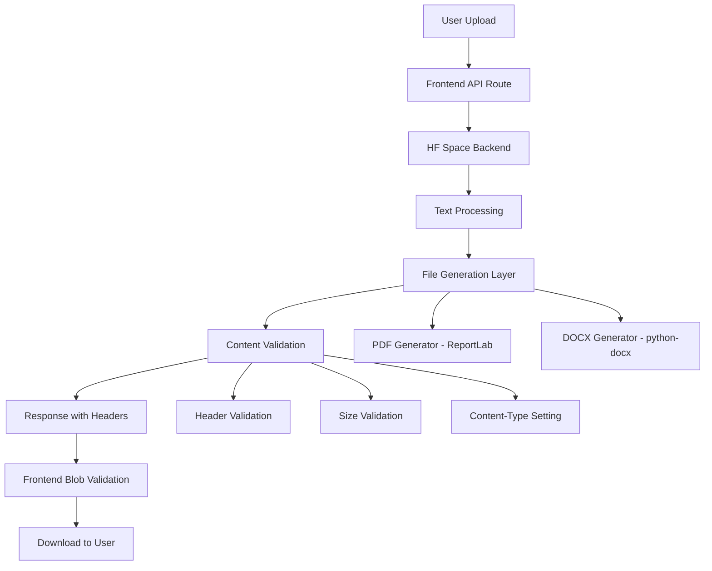

# Design Document

## Overview

This design addresses the critical PDF/DOCX file corruption issue in AquaHumanizer Pro by implementing robust file generation, proper response handling, and comprehensive validation throughout the download pipeline. The solution focuses on three main areas: backend file generation improvements, frontend API route validation, and enhanced error handling.

## Architecture

The fix involves a multi-layer approach:



## Components and Interfaces

### Backend File Generation Layer

**PDF Generator (Enhanced)**
- Uses ReportLab's `SimpleDocTemplate` instead of basic `Canvas`
- Implements proper paragraph, bullet point, and heading formatting
- Validates PDF header (`%PDF`) before serving
- Handles text wrapping and page breaks correctly

**DOCX Generator (Enhanced)**
- Uses python-docx with proper styling and margins
- Validates DOCX header (`PK` - ZIP format) before serving
- Implements consistent bullet point and heading formatting
- Handles special characters and encoding properly

**Content Validator**
- Verifies file size > 0 bytes
- Validates file format headers
- Sets appropriate Content-Type and Content-Length headers
- Logs validation results for debugging

### Frontend API Route Layer

**Request Handler**
- Forwards requests to HF Space with proper query parameters
- Implements timeout handling for large documents
- Validates file types before processing

**Blob Validator**
- Checks received blob size > 0
- Verifies content-type matches expected format
- Preserves all backend headers
- Logs blob properties for debugging

**Response Builder**
- Sets proper headers for file downloads
- Implements cache control headers
- Handles error responses with detailed messages

### Frontend Download Handler

**File Download Manager**
- Creates proper filenames with correct extensions
- Implements URL cleanup after download
- Shows progress indicators during processing
- Displays success/error notifications with file details

## Data Models

### File Generation Request
```typescript
interface DocumentRequest {
  file: File
  style: 'neutral' | 'formal' | 'ats' | 'bullets'
  output_format: 'json' | 'pdf' | 'docx'
}
```

### File Generation Response
```typescript
interface FileResponse {
  blob: Blob
  contentType: string
  contentDisposition: string
  contentLength: string
}
```

### Validation Result
```python
class ValidationResult:
    is_valid: bool
    file_size: int
    content_type: str
    error_message: Optional[str]
```

## Correctness Properties

*A property is a characteristic or behavior that should hold true across all valid executions of a system-essentially, a formal statement about what the system should do. Properties serve as the bridge between human-readable specifications and machine-verifiable correctness guarantees.*

### File Generation Properties

**Property 1: PDF Header Validation**
*For any* text content processed by the PDF generator, the generated file should start with the '%PDF' header
**Validates: Requirements 1.1**

**Property 2: DOCX Header Validation**
*For any* text content processed by the DOCX generator, the generated file should start with the 'PK' header (ZIP format)
**Validates: Requirements 1.2**

**Property 3: Non-empty File Generation**
*For any* valid text input, the generated file should have a size greater than zero bytes
**Validates: Requirements 1.3**

**Property 4: Error Response on Failure**
*For any* file generation failure, the system should return a descriptive error message instead of corrupted or empty data
**Validates: Requirements 1.4**

### Response Header Properties

**Property 5: PDF Content-Type Headers**
*For any* PDF file response, the Content-Type header should contain 'application/pdf'
**Validates: Requirements 2.1**

**Property 6: DOCX Content-Type Headers**
*For any* DOCX file response, the Content-Type header should contain 'application/vnd.openxmlformats-officedocument.wordprocessingml.document'
**Validates: Requirements 2.2**

**Property 7: Content-Length Header Presence**
*For any* file response, the Content-Length header should be present and match the actual file size
**Validates: Requirements 2.3**

**Property 8: Cache-Control Headers**
*For any* file response, the Cache-Control header should be present to prevent caching issues
**Validates: Requirements 2.5**

### Frontend Validation Properties

**Property 9: Blob Size Validation**
*For any* blob received by the frontend, the blob size should be greater than zero before processing
**Validates: Requirements 3.1**

**Property 10: PDF Content-Type Validation**
*For any* PDF download request, the frontend should verify the content-type contains 'pdf' before serving
**Validates: Requirements 3.2**

**Property 11: DOCX Content-Type Validation**
*For any* DOCX download request, the frontend should verify the content-type contains 'officedocument' before serving
**Validates: Requirements 3.3**

**Property 12: Error Response on Validation Failure**
*For any* blob validation failure, the frontend should return an error response instead of serving corrupted data
**Validates: Requirements 3.4**

**Property 13: Header Preservation**
*For any* backend response, all headers including Content-Disposition should be preserved in the frontend response
**Validates: Requirements 3.5**

### Download Management Properties

**Property 14: Filename Generation**
*For any* download request, the generated filename should have the correct extension matching the output format
**Validates: Requirements 4.1**

**Property 15: URL Cleanup**
*For any* completed download, the temporary blob URL should be properly cleaned up to prevent memory leaks
**Validates: Requirements 4.4**

### Logging Properties

**Property 16: Error Logging**
*For any* file generation failure, detailed error information with stack traces should be logged
**Validates: Requirements 5.1**

**Property 17: Blob Validation Logging**
*For any* blob validation failure, the blob properties should be logged for debugging
**Validates: Requirements 5.2**

**Property 18: Success Metrics Logging**
*For any* successful download, file sizes and processing times should be logged
**Validates: Requirements 5.3**

**Property 19: Header Validation Logging**
*For any* file generation, header validation results should be logged before serving
**Validates: Requirements 5.4**

**Property 20: Download Attempt Logging**
*For any* download attempt, the success or failure status should be logged
**Validates: Requirements 5.5**

### Content Formatting Properties

**Property 21: PDF Formatting Consistency**
*For any* text containing paragraphs, bullet points, and headings, the PDF generator should format them appropriately
**Validates: Requirements 6.1**

**Property 22: DOCX Structure Preservation**
*For any* text input, the DOCX generator should preserve text structure and apply proper styles
**Validates: Requirements 6.2**

**Property 23: Cross-Format Bullet Consistency**
*For any* text containing bullet points, both PDF and DOCX generators should format them consistently
**Validates: Requirements 6.3**

**Property 24: Special Character Handling**
*For any* text containing special characters, both generators should handle encoding properly without corruption
**Validates: Requirements 6.4**

**Property 25: Heading Style Application**
*For any* text containing headings, both generators should apply appropriate heading styles
**Validates: Requirements 6.5**

### System Reliability Properties

**Property 26: Dependency Availability**
*For any* backend startup, all file generation dependencies should be verified as available
**Validates: Requirements 7.3**

**Property 27: Import Error Handling**
*For any* module import, proper error handling should be implemented to prevent system crashes
**Validates: Requirements 7.5**

## Error Handling

### Backend Error Handling
- **File Generation Failures**: Catch all exceptions during PDF/DOCX generation and return HTTP 500 with descriptive error messages
- **Dependency Missing**: Validate required libraries (reportlab, python-docx) are available at startup
- **Memory Issues**: Handle large document processing with appropriate memory management
- **Encoding Errors**: Properly handle special characters and encoding issues in text processing

### Frontend Error Handling
- **Network Failures**: Implement timeout handling and retry logic for HF Space requests
- **Blob Validation Failures**: Return proper error responses when received blobs are invalid
- **Download Failures**: Show user-friendly error messages when downloads fail
- **File Size Validation**: Reject empty or oversized files with appropriate error messages

### Logging Strategy
- **Structured Logging**: Use consistent log format with timestamps, levels, and context
- **Error Context**: Include stack traces and relevant data in error logs
- **Performance Metrics**: Log processing times and file sizes for monitoring
- **Debug Information**: Log blob properties and header information for troubleshooting

## Testing Strategy

### Unit Testing
- Test individual file generation functions with various text inputs
- Test header validation functions with different file types
- Test blob validation logic with valid and invalid inputs
- Test filename generation with different input scenarios
- Test error handling paths with simulated failures

### Property-Based Testing
- Use **pytest** with **hypothesis** library for Python backend testing
- Use **Jest** with **fast-check** library for TypeScript frontend testing
- Configure each property test to run minimum 100 iterations
- Each property test must reference its design document property using the tag format: **Feature: fix-pdf-docx-corruption, Property {number}: {property_text}**

**Backend Property Tests (Python)**:
- Generate random text content and verify PDF/DOCX headers are correct
- Test file generation with various content types (paragraphs, bullets, headings)
- Verify all responses include proper headers and content-length
- Test error handling with invalid inputs and simulated failures

**Frontend Property Tests (TypeScript)**:
- Test blob validation with various blob sizes and content types
- Verify header preservation across API route processing
- Test filename generation with different file types and names
- Test download URL cleanup after various completion scenarios

### Integration Testing
- End-to-end testing of document upload → processing → download flow
- Test with actual large documents (1000+ words) to verify chunking works
- Test both PDF and DOCX generation with real document content
- Verify downloaded files can be opened by standard applications
- Test error scenarios like network failures and invalid files

### Manual Testing Checklist
- Upload various document types (.txt, .docx) and verify processing
- Test all output formats (JSON, PDF, DOCX) with different styles
- Verify downloaded files open correctly in standard applications
- Test with large documents to ensure no corruption occurs
- Verify error messages are user-friendly and informative

<function_calls>
<invoke name="prework">
<parameter name="featureName">fix-pdf-docx-corruption