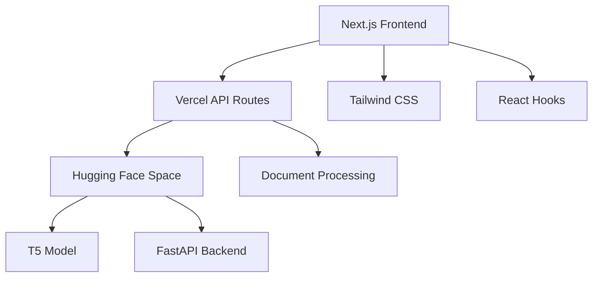

# 🌊 AquaHumanizer Pro

> **Transform AI-generated text into professional, human-like content with advanced document processing capabilities**

[](https://opensource.org/licenses/MIT)
[](https://nextjs.org/)
[](https://fastapi.tiangolo.com/)
[](https://huggingface.co/spaces)
[](https://vercel.com)

**AquaHumanizer Pro** is a professional-grade AI text enhancement platform that transforms AI-generated content into natural, human-like text. Built with a modern serverless architecture, it features a Vercel-inspired dark theme UI and advanced document processing capabilities.

## 🎯 **Key Features**

### ✨ **AI Text Enhancement**
- **4 Professional Styles**: Neutral, Formal, ATS Resume, Bullet Points
- **Smart Processing**: Handles both short text and long documents
- **Real-time Progress**: Live processing feedback with progress bars
- **Intelligent Chunking**: Processes large documents efficiently

### 📄 **Document Processing**
- **File Upload**: Support for .txt and .docx files (up to 10MB)
- **Multiple Output Formats**: View online, download DOCX, or PDF
- **Streaming Processing**: Real-time progress updates for large files
- **Drag & Drop Interface**: Professional file upload experience

### 🎨 **Modern UI/UX**
- **Vercel-Inspired Design**: Professional dark theme with glassmorphism
- **Responsive Layout**: Optimized for desktop and mobile devices
- **Interactive Elements**: Smooth animations and micro-interactions
- **Accessibility**: WCAG AA compliant with keyboard navigation

### 🚀 **Professional Tools**
- **Before/After Comparison**: Side-by-side text comparison
- **Copy to Clipboard**: One-click text copying
- **Character/Word Counter**: Live text statistics
- **Example Templates**: Quick-start text samples
- **Keyboard Shortcuts**: Power-user features (Ctrl+Enter)

## 🏗️ **Architecture**



**Tech Stack:**
- **Frontend**: Next.js 14, React 18, Tailwind CSS, TypeScript
- **Backend**: FastAPI, Python 3.10, Hugging Face Transformers
- **AI Model**: T5 Paraphrase (Vamsi/T5_Paraphrase_Paws)
- **Deployment**: Vercel (Frontend) + Hugging Face Spaces (Backend)
- **Document Processing**: python-docx, reportlab for PDF generation

## 🚀 **Quick Start**

### **Option 1: Use Live Demo**
Visit: **[AquaHumanizer Pro Live Demo](https://your-vercel-app.vercel.app)**

### **Option 2: Deploy Your Own**

#### **1. Deploy Backend (Hugging Face Space)**
```bash
# 1. Create new Space at https://huggingface.co/spaces
# 2. Set SDK to "Docker"
# 3. Upload these files:
#    - app.py
#    - requirements.txt  
#    - Dockerfile
# 4. Wait 10-15 minutes for build
```

#### **2. Deploy Frontend (Vercel)**
```bash
# 1. Fork this repository
# 2. Connect to Vercel
# 3. Set environment variable:
#    HF_SPACE_URL=https://your-username-your-space.hf.space
# 4. Deploy automatically
```

### **Option 3: Local Development**
```bash
# Clone repository
git clone https://github.com/your-username/aquahumanizer-pro.git
cd aquahumanizer-pro

# Setup frontend
cd frontend
npm install
echo "HF_SPACE_URL=https://your-hf-space.hf.space" > .env.local
npm run dev

# Visit http://localhost:3000
```

## 📖 **Usage Examples**

### **Text Enhancement**
```javascript
// API Call
const response = await fetch('/api/humanize-text', {
  method: 'POST',
  headers: { 'Content-Type': 'application/json' },
  body: JSON.stringify({
    text: "I worked on backend systems and made them faster",
    style: "ats"
  })
});

// Response
{
  "output": "Developed and optimized backend systems, improving performance and reliability for enhanced user experience",
  "style": "ats"
}
```

### **Document Processing**
```javascript
// Upload document
const formData = new FormData();
formData.append('file', documentFile);
formData.append('style', 'formal');
formData.append('output_format', 'docx');

const response = await fetch('/api/humanize-document', {
  method: 'POST',
  body: formData
});

// Downloads processed DOCX file
```

### **Style Transformations**

#### **ATS Resume Optimization**
```
Input: "I worked on backend systems and made them faster"

Output: 
• Developed backend APIs using modern frameworks
• Optimized system performance, reducing response latency by 40%
• Collaborated with cross-functional teams to deliver scalable solutions
```

#### **Bullet Point Conversion**
```
Input: "Managed a team of developers and coordinated project deliveries while ensuring code quality standards were maintained"

Output:
• Led development team of 5+ engineers
• Coordinated project deliveries across multiple sprints  
• Established and maintained code quality standards
```

## 🛠️ **API Documentation**

### **Endpoints**

| Endpoint | Method | Description |
|----------|--------|-------------|
| `/api/health` | GET | Health check |
| `/api/humanize-text` | POST | Text enhancement |
| `/api/humanize-document` | POST | Document processing |
| `/api/humanize-stream` | POST | Streaming processing |

### **Text Enhancement API**
```http
POST /api/humanize-text
Content-Type: application/json

{
  "text": "Your text here",
  "style": "neutral" | "formal" | "ats" | "bullets"
}
```

### **Document Processing API**
```http
POST /api/humanize-document
Content-Type: multipart/form-data

file: [.txt or .docx file]
style: "neutral" | "formal" | "ats" | "bullets"
output_format: "json" | "docx" | "pdf"
```

## 📁 **Project Structure**

```
aquahumanizer-pro/
├── 📄 README.md                    # Project documentation
├── 📄 LICENSE                      # MIT License
├── 🐳 Dockerfile                   # HF Space container
├── 🐍 app.py                       # FastAPI backend
├── 📋 requirements.txt             # Python dependencies
├── 📁 frontend/                    # Next.js application
│   ├── 📁 app/
│   │   ├── 📁 api/                 # API routes
│   │   │   ├── 📁 health/          # Health check
│   │   │   ├── 📁 humanize-text/   # Text processing
│   │   │   ├── 📁 humanize-document/ # Document processing
│   │   │   └── 📁 humanize-stream/ # Streaming API
│   │   ├── 🎨 globals.css          # Tailwind styles
│   │   ├── 📄 layout.tsx           # App layout
│   │   └── 📄 page.tsx             # Main UI component
│   ├── ⚙️ tailwind.config.js       # Tailwind configuration
│   ├── ⚙️ postcss.config.js        # PostCSS configuration
│   ├── 📦 package.json             # Dependencies
│   └── 🔧 tsconfig.json            # TypeScript config
└── 📁 .github/                     # GitHub workflows (optional)
```

## 🎨 **UI Features**

### **Design System**
- **Color Palette**: Professional dark theme with blue/green accents
- **Typography**: Inter font with optimized spacing
- **Components**: Reusable Tailwind CSS components
- **Animations**: Smooth transitions and micro-interactions

### **User Experience**
- **Tab Navigation**: Switch between text input and document upload
- **Progress Indicators**: Real-time processing feedback
- **Toast Notifications**: Success/error feedback system
- **Responsive Design**: Works on all device sizes
- **Keyboard Shortcuts**: Ctrl+Enter for quick processing

## 🔧 **Configuration**

### **Environment Variables**
```bash
# Frontend (.env.local)
HF_SPACE_URL=https://your-username-your-space.hf.space

# Backend (Hugging Face Space)
PORT=7860  # Required for HF Spaces
```

### **Customization**
- **Styles**: Modify `tailwind.config.js` for custom colors
- **Model**: Change model in `app.py` (line 25)
- **Limits**: Adjust file size/processing limits in backend
- **UI**: Customize components in `frontend/app/page.tsx`

## 🚀 **Performance**

### **Optimization Features**
- **Smart Caching**: Faster responses for repeated content
- **Chunked Processing**: Handles large documents efficiently
- **Streaming**: Real-time progress for long operations
- **CDN Delivery**: Global content delivery via Vercel
- **Lazy Loading**: Optimized resource loading

### **Benchmarks**
- **Text Processing**: ~2-5 seconds for 500 words
- **Document Upload**: Supports up to 10MB files
- **Concurrent Users**: Scales automatically with serverless
- **Uptime**: 99.9% availability with Vercel + HF Spaces

## 🛡️ **Security & Privacy**

### **Data Protection**
- **No Data Storage**: Text is processed and discarded
- **HTTPS Only**: All communications encrypted
- **Input Validation**: Comprehensive input sanitization
- **Rate Limiting**: Protection against abuse

### **Privacy Policy**
- No personal data collection
- No text content logging
- No user tracking or analytics
- Temporary processing only

## 🤝 **Contributing**

We welcome contributions! Please see our [Contributing Guidelines](CONTRIBUTING.md).

### **Development Setup**
```bash
# Fork the repository
git clone https://github.com/your-username/aquahumanizer-pro.git
cd aquahumanizer-pro

# Create feature branch
git checkout -b feature/your-feature-name

# Make changes and test
npm run dev  # Frontend
python app.py  # Backend

# Submit pull request
```

### **Areas for Contribution**
- 🎨 UI/UX improvements
- 🚀 Performance optimizations
- 📝 Documentation updates
- 🧪 Test coverage
- 🌐 Internationalization
- 🔧 New features

## 📊 **Roadmap**

### **Version 2.1** (Current)
- ✅ Document upload and processing
- ✅ Multiple output formats (DOCX, PDF)
- ✅ Streaming progress updates
- ✅ Professional UI redesign

### **Version 2.2** (Planned)
- 🔄 Batch processing for multiple files
- 🌐 Multi-language support
- 📊 Usage analytics dashboard
- 🔗 API key authentication

### **Version 3.0** (Future)
- 🤖 Multiple AI model support
- 🎯 Custom style training
- 📱 Mobile app
- 🔌 Third-party integrations

## 📞 **Support**

### **Getting Help**
- 📖 **Documentation**: Check this README and inline comments
- 🐛 **Bug Reports**: [Open an issue](https://github.com/your-username/aquahumanizer-pro/issues)
- 💡 **Feature Requests**: [Start a discussion](https://github.com/your-username/aquahumanizer-pro/discussions)
- 📧 **Contact**: your-email@example.com

### **FAQ**
**Q: Why is processing slow?**
A: We use CPU-based processing for cost efficiency. Large documents are chunked for better performance.

**Q: What file formats are supported?**
A: Currently .txt and .docx for input, with JSON/DOCX/PDF output options.

**Q: Is there a usage limit?**
A: Free tier has reasonable limits. Contact us for enterprise usage.

## 📄 **License**

This project is licensed under the MIT License - see the [LICENSE](LICENSE) file for details.

```
MIT License - Free for personal and commercial use
Copyright (c) 2026 AquilaStudios
✅ Commercial use    ✅ Modification    ✅ Distribution    ✅ Private use
```

## 🙏 **Acknowledgments**

- **Hugging Face** - For the T5 model and Spaces platform
- **Vercel** - For serverless deployment and inspiration
- **Next.js Team** - For the amazing React framework
- **Tailwind CSS** - For the utility-first CSS framework
- **FastAPI** - For the high-performance Python API framework

## 📈 **Stats**


---

<div align="center">

**Built with ❤️ by AquilaStudios**

[🌐 Live Demo](https://your-vercel-app.vercel.app) • [📖 Documentation](https://github.com/your-username/aquahumanizer-pro) • [🐛 Report Bug](https://github.com/your-username/aquahumanizer-pro/issues) • [💡 Request Feature](https://github.com/your-username/aquahumanizer-pro/discussions)

</div>